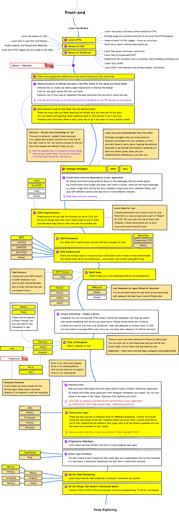

# Junior Javascript Developer Training Materials

## Front-end developer roadmap

The training program for juniors mainly based on Front-end developers roadmap. The latest version of the roadmap could be found [here](https://github.com/kamranahmedse/developer-roadmap)

## Module: Web Fundamentals

1. [**Git**](./fundamentals/git.md)
2. [**HTML&CSS**](./fundamentals/html-css.md)
3. [**Javascript Core**](./fundamentals/js-core.md)
4. [**Development Tools**](./fundamentals/devtools.md)

## Module: Advanced Javascript

1. [**ES6&ES2015**](./advance/esnext.md)
2. [**Storage API**](./advance/storageapi.md)
3. [**Canvas API**](./advance/canvasapi.md)

## Module: Web Applications

1. [**PWA**](./webapps/pwa.md)

## Module: React
1. [**React Basics**](./react/basics.md)
2. [**Redux**](./react/redux.md)
3. [**MobX**](./react/mobx.md)

## Challenge
1. [**30 Day Vanilla JS Coding Challenge**](https://javascript30.com)
